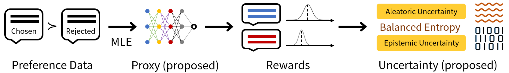
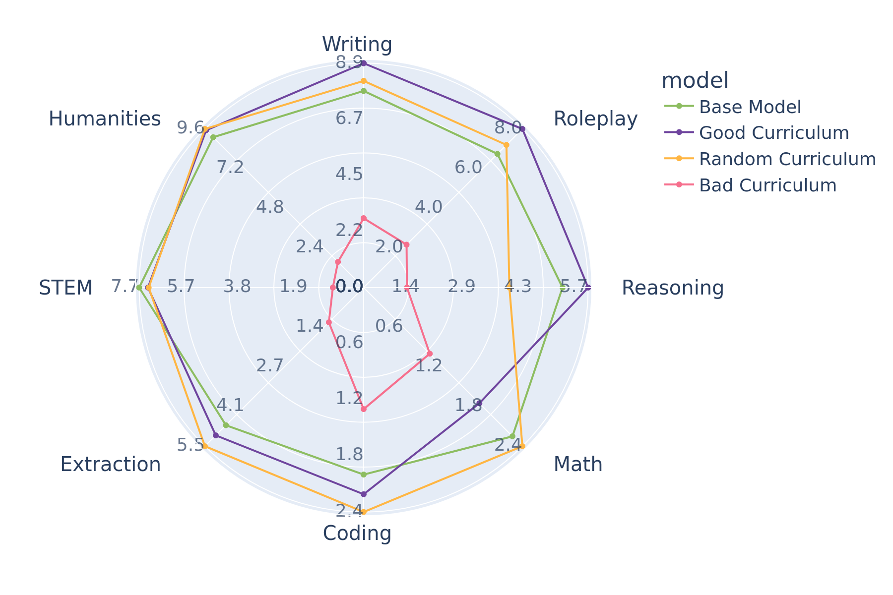

# Advancing Instruction Following in Language Models with a Proxy-Based Uncertainty Approach

<b>Uncertainty of LM</b> from DALL·E 3

----

We propose a novel Uncertainty-aware Reward Model (URM) to quantify the uncertainty of Language Models.

<b>Proxy Uncertainty</b>

Curriculum Learning

<b>Why Curriculum learning is important?</b>

